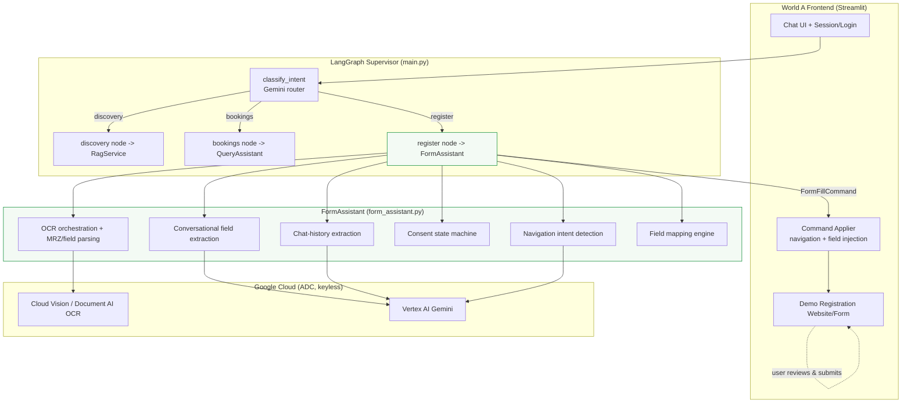
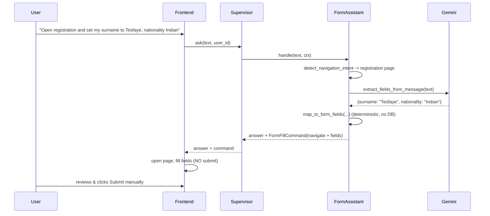
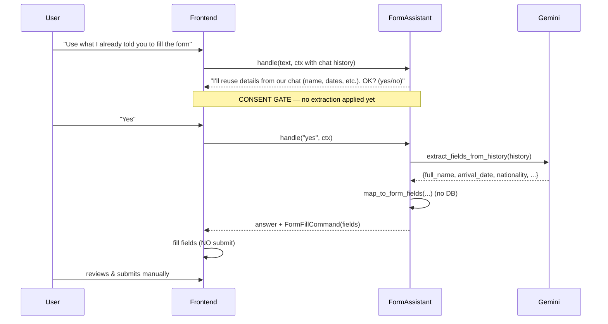

# Design Document: Registration Form Assistant

## Overview

The **Registration Form Assistant** is the third assistant ("form-fill / registration
bot") in the Ethiopia Tourism AI Assistant POC. It helps a signed-in traveller
register for a tourism package by driving a real website's registration form from
chat. This is **"World A"**: the chatbot and a real website are shown side by side,
and the bot can (a) **navigate** the website (auto-open the registration page or any
page the user asks for) and (b) **fill form fields** on the user's behalf.

The bot operates under three hard constraints that shape the entire design:

1. **No database writes.** The bot never inserts/updates/deletes any row. It only
   emits *form-fill commands* that the frontend applies to input fields.
2. **No auto-submit.** The bot never submits the form. The **user** reviews every
   field and clicks submit manually. The human stays in control of submission.
3. **Consent-gated auto-fill.** The two auto-fill data sources — (a) passport OCR
   and (b) prior chat/text history — are only used *after the bot asks and the user
   explicitly agrees*.

Auto-fill data comes from two sources, both consent-gated: **GCP OCR** over an
uploaded passport image (standardized on Google Cloud, keyless ADC — replacing the
legacy AWS Textract reference), and **chat-history extraction** that reuses details
the user already typed. The bot fits the existing enterprise single-file pattern
(frozen `Settings`, typed exception hierarchy, structured logging, lazy `bootstrap()`,
a Service class) and plugs into the existing LangGraph supervisor as a new
`register` route.

> **Scope note:** POC scope, English-only, aligned with the user's earlier "we can
> scale down a bit". The registration **website already exists** and **shares the same
> UI** as the bot (confirmed), so the bridge is a shared-frontend `FormFillCommand`
> that the frontend applies. The real form field ids and page routes will be wired in
> later; this design uses `reg_*` **placeholders** in `FIELD_MAP`/`known_pages` as the
> single point of change. See **Confirmed Decisions & Remaining Open Items**.

---

# PART 1 — HIGH-LEVEL DESIGN

## Architecture

The form assistant is a new node in the existing LangGraph supervisor. It never
touches the database (unlike the bookings route). Instead, it returns a structured
**FormFillCommand** that the Streamlit frontend applies to the demo registration
form. OCR is delegated to a GCP OCR service using ADC (no keys).



Key architectural properties:

- The **register node returns commands, not side effects.** It produces a
  `FormFillCommand` (navigate + field values) that the frontend applies. No DB
  session is opened anywhere in the form-fill path.
- The **authenticated `user_id`** flows through graph state exactly as it does for
  bookings — supplied by the trusted session, never derived from chat text. It is
  used to scope chat-history and (optionally) to prefill contact fields, never to
  authorize a write.
- **Submission is a frontend/user action.** The command schema has no "submit"
  capability; the design forbids it structurally.

## Component Responsibilities

| Component | Responsibility |
|-----------|----------------|
| **Command Applier (frontend)** | Applies `FormFillCommand`: opens the requested page and writes values into form fields. Never auto-clicks submit. Renders passport upload + consent prompts. |
| **Demo Registration Website/Form** | Minimal registration form (built for POC) whose fields map to `visa_applications` / `package_requests`. Owns the actual submit button. |
| **register node (main.py)** | Bridges supervisor state and `FormAssistant`; passes `user_id`, chat history, and any uploaded image reference; returns answer text + command. |
| **Navigation intent detection** | Classifies "open registration / go to page X" and maps to a page id. |
| **Conversational field extraction** | LLM extracts field *values* from the current turn; deterministic code maps them to form fields. |
| **Chat-history extraction** | Consent-gated: mines earlier conversation for reusable field values. |
| **Consent state machine** | Tracks whether the bot has asked for and received consent for OCR / history reuse. |
| **OCR orchestration + parsing** | Calls GCP OCR on the passport image, parses MRZ + labeled text, maps to fields. Handles low-quality/failed OCR. |
| **Field mapping engine** | Deterministic map from extracted keys to form field ids and model columns. |

## Data Flow 1 — Conversational Form-Fill (user dictates values)



## Data Flow 2 — Passport OCR → Form-Fill (consent-gated)

```mermaid
sequenceDiagram
    participant U as User
    participant UI as Frontend
    participant F as FormAssistant
    participant V as GCP OCR (Vision/Doc AI)

    U->>UI: "Fill the form from my passport"
    UI->>F: handle(text, ctx)
    F-->>UI: "This will read your passport image. Do you consent? (yes/no)"
    Note over F,UI: CONSENT GATE — no OCR yet
    U->>UI: "Yes"
    UI->>F: handle("yes", ctx with uploaded image bytes)
    F->>V: document_text_detection(image)  (ADC, keyless)
    alt OCR success
        V-->>F: text + MRZ block
        F->>F: parse_passport_fields (MRZ + labels)
        F->>F: map_to_form_fields(...)  (transient, no persist)
        F-->>UI: answer + FormFillCommand(fields)
        UI->>UI: fill fields (NO submit); discard image bytes
    else low quality / failure
        V-->>F: error / empty
        F-->>UI: "Couldn't read the passport clearly. Try a sharper photo."
    end
    U->>UI: reviews & submits manually
```

## Data Flow 3 — Chat-History → Form-Fill (consent-gated)



## Error Handling (high level)

| Scenario | Response | Recovery |
|----------|----------|----------|
| Low-quality / unreadable passport image | Friendly message asking for a sharper photo | User re-uploads; no partial fill |
| OCR service error (network/ADC) | "OCR is temporarily unavailable" | Fall back to conversational or history fill |
| Consent declined | Acknowledge; do not read image / history | Offer conversational fill instead |
| No uploaded image but OCR requested | Ask user to upload first | Prompt upload widget |
| Unknown navigation target | Ask which page, or default to registration | List known pages |
| Extraction yields no fields | "I didn't catch any details to fill" | Ask user to restate |

## Security & Privacy (high level)

- **Passport images are PII and are never persisted.** Image bytes live only in the
  transient request context; after OCR + mapping they are discarded. No image and no
  extracted PII is written to `tourism.db` (the route holds no DB session).
- **`user_id` remains trusted-session-sourced**, matching `query_assistant.py`.
- **Submission is user-initiated only**; the command schema cannot submit.
- **No new secrets** — GCP OCR uses ADC, consistent with the keyless architecture.

---

# PART 2 — LOW-LEVEL DESIGN

Language: **Python** (matches the existing codebase and enterprise single-file
style). New file: **`form_assistant.py`**. Small edits to **`main.py`** and
**`app_ui.py`**.

## New file layout: `form_assistant.py`

Mirrors `query_assistant.py` / `rag.py`:

```pascal
SECTION 0  Exceptions      (FormAssistantError hierarchy)
SECTION 1  Logging         (logger + configure_logging)
SECTION 2  Configuration   (frozen Settings + load_settings)
SECTION 3  Data structures (ConsentState, FormFillCommand, FieldMapping)
SECTION 4  Navigation      (detect_navigation_intent)
SECTION 5  Extraction      (conversation + history via Gemini)
SECTION 6  OCR pipeline    (GCP OCR + passport/MRZ parsing)
SECTION 7  Consent state machine
SECTION 8  Field mapping engine
SECTION 9  FormAssistant service (bootstrap / handle)
SECTION 10 CLI
```

## Core Interfaces / Types

```python
from __future__ import annotations
from dataclasses import dataclass, field
from enum import Enum
from typing import Optional


# ---- Exceptions -----------------------------------------------------------
class FormAssistantError(Exception): ...
class ConfigurationError(FormAssistantError): ...
class OcrError(FormAssistantError): ...              # OCR call failed
class OcrQualityError(OcrError): ...                 # image unreadable / low quality
class ExtractionError(FormAssistantError): ...       # LLM value extraction failed


# ---- Consent --------------------------------------------------------------
class DataSource(str, Enum):
    CONVERSATION = "conversation"   # values dictated in the current message
    PASSPORT_OCR = "passport_ocr"   # consent-gated
    CHAT_HISTORY = "chat_history"   # consent-gated


class ConsentStatus(str, Enum):
    NOT_ASKED = "not_asked"
    AWAITING = "awaiting"           # bot asked, waiting for yes/no
    GRANTED = "granted"
    DENIED = "denied"


@dataclass
class ConsentState:
    """Per-source consent, carried in supervisor state across turns."""
    passport_ocr: ConsentStatus = ConsentStatus.NOT_ASKED
    chat_history: ConsentStatus = ConsentStatus.NOT_ASKED


# ---- Navigation -----------------------------------------------------------
@dataclass(frozen=True)
class NavigationTarget:
    page_id: str            # e.g. "registration", "home", "packages", "visa"
    url_path: str           # e.g. "/register"
    confident: bool         # False -> ask user to confirm target


# ---- The command emitted to the frontend ---------------------------------
@dataclass
class FormFillCommand:
    """Structured instruction the frontend applies to the website.

    IMPORTANT BOUNDARIES (enforced by the absence of any submit capability):
      * navigate_to : optional page to open.
      * field_values: form_field_id -> string value to inject.
      * NEVER contains a submit action. NEVER writes to the DB.
    """
    navigate_to: Optional[NavigationTarget] = None
    field_values: dict[str, str] = field(default_factory=dict)
    source: Optional[DataSource] = None            # provenance, for the UI note
    # deliberately: NO `submit` field, NO db handles.


@dataclass
class FormAssistantResult:
    """What the register node returns to the supervisor."""
    answer: str                                     # natural-language reply
    command: Optional[FormFillCommand] = None       # applied by the frontend
    consent: ConsentState = field(default_factory=ConsentState)
```

## Configuration (frozen dataclass Settings)

```python
@dataclass(frozen=True)
class Settings:
    gcp_project_id: str
    gcp_location: str = "us-central1"
    llm_model: str = "gemini-2.5-flash"             # LLM_MODEL env var

    # GCP OCR
    ocr_backend: str = "vision"                     # "vision" | "document_ai"
    ocr_location: str = "us"                        # Document AI processor location
    doc_ai_processor_id: str = ""                   # required only if backend=document_ai
    max_image_bytes: int = 8 * 1024 * 1024          # reject oversized uploads

    # Demo site
    known_pages: tuple[str, ...] = (
        "registration", "home", "packages", "visa",
    )
    registration_path: str = "/register"

    log_level: str = "WARNING"

    def validate(self) -> None:
        """Fail fast. Requires GCP_PROJECT_ID; if backend=document_ai,
        DOC_AI_PROCESSOR_ID must be set."""
        ...


def load_settings() -> Settings: ...                # load_dotenv + env, then validate
```

## Key Functions with Formal Specifications

### `detect_navigation_intent`

```python
def detect_navigation_intent(
    llm, message: str, settings: Settings
) -> Optional[NavigationTarget]:
    """Return a NavigationTarget if the user asked to open/go to a page."""
```
- **Preconditions:** `message` is a non-null string; `settings.known_pages` non-empty.
- **Postconditions:** returns `None` if no navigation requested; otherwise a
  `NavigationTarget` whose `page_id` ∈ `known_pages`. If the target is ambiguous,
  `confident=False` (caller asks the user). No side effects; no DB access.

### `extract_fields_from_message`

```python
def extract_fields_from_message(
    llm, message: str
) -> dict[str, str]:
    """LLM extracts raw field values from the current user message.
    Returns a dict of canonical_key -> value (strings). No mapping here."""
```
- **Preconditions:** `message` non-null.
- **Postconditions:** returns a (possibly empty) dict of canonical keys defined in
  `CANONICAL_KEYS`; values are trimmed strings. Never returns SQL, code, or DB
  writes. On LLM failure raises `ExtractionError`.

### `extract_fields_from_history`

```python
def extract_fields_from_history(
    llm, history: list[dict]
) -> dict[str, str]:
    """Consent-gated: mine prior chat turns for reusable field values."""
```
- **Preconditions:** consent for `CHAT_HISTORY` is `GRANTED`; `history` is a list of
  `{role, content}` turns.
- **Postconditions:** returns canonical_key -> value dict from information the user
  already provided. Must NOT invent values not present in history. No DB access.

### `run_passport_ocr`

```python
def run_passport_ocr(
    client, image_bytes: bytes, settings: Settings
) -> str:
    """Invoke GCP OCR (Cloud Vision document_text_detection OR Document AI)
    and return the full extracted text (incl. the MRZ lines)."""
```
- **Preconditions:** consent for `PASSPORT_OCR` is `GRANTED`;
  `0 < len(image_bytes) <= settings.max_image_bytes`; ADC available.
- **Postconditions:** returns non-empty OCR text on success. Raises `OcrQualityError`
  if the response is empty/too sparse to be a passport; raises `OcrError` on a
  service/transport failure. **Does not persist the image.**

### `parse_passport_fields`

```python
def parse_passport_fields(ocr_text: str) -> dict[str, str]:
    """Parse OCR text into canonical passport fields.
    Prefers the MRZ (machine-readable zone); falls back to labeled lines."""
```
- **Preconditions:** `ocr_text` non-empty.
- **Postconditions:** returns canonical_key -> value for the fields it could parse
  (e.g. `surname`, `given_name`, `passport_no`, `nationality`, `date_of_birth`,
  `gender`, `passport_expiry_date`, `country_of_birth`/issuing country). Missing
  fields are simply absent. Dates normalized to ISO `YYYY-MM-DD`.
- **MRZ note:** TD3 passport MRZ = two 44-char lines; surname/given split on `<<`,
  positions give passport number, nationality, DOB (YYMMDD), sex, expiry. Falls back
  to label heuristics when MRZ is unreadable.

### `map_to_form_fields`

```python
def map_to_form_fields(
    canonical: dict[str, str]
) -> dict[str, str]:
    """Deterministically map canonical keys to frontend form field ids.
    Pure function: no LLM, no DB, no I/O."""
```
- **Preconditions:** keys of `canonical` ⊆ `CANONICAL_KEYS`.
- **Postconditions:** returns `form_field_id -> value` using `FIELD_MAP`. Unknown
  canonical keys are skipped. Idempotent and side-effect free.

### Consent handling

```python
def request_consent(source: DataSource) -> str:
    """Return the prompt asking the user to consent to a data source."""

def interpret_consent_reply(message: str) -> Optional[bool]:
    """Return True (yes), False (no), or None (not a yes/no) for a reply."""

def update_consent(
    state: ConsentState, source: DataSource, granted: bool
) -> ConsentState:
    """Return a new ConsentState with the source's status set."""
```
- **Invariant:** OCR / history extraction functions are only ever called when the
  corresponding `ConsentStatus == GRANTED`. This is enforced in `handle()` before any
  read of the image or history.

## Algorithmic Pseudocode — `FormAssistant.handle`

```pascal
ALGORITHM handle(message, ctx)
INPUT:  message: string
        ctx: { user_id, history[], image_bytes?, consent: ConsentState }
OUTPUT: FormAssistantResult
PRECONDITION:  user_id came from trusted session (never from chat text)
POSTCONDITION: result.command has NO submit action AND no DB write occurred

BEGIN
    consent <- ctx.consent
    command <- new FormFillCommand()

    // 1) Navigation (independent of consent)
    nav <- detect_navigation_intent(llm, message, settings)
    IF nav <> NULL THEN
        IF NOT nav.confident THEN
            RETURN Result("Which page did you mean?", NULL, consent)
        END IF
        command.navigate_to <- nav
    END IF

    // 2) If we are AWAITING a consent answer, interpret yes/no first
    IF consent has any AWAITING source THEN
        decision <- interpret_consent_reply(message)
        IF decision = NULL THEN
            RETURN Result("Please answer yes or no.", command, consent)
        END IF
        source <- the AWAITING source
        consent <- update_consent(consent, source, decision)
        IF decision = FALSE THEN
            RETURN Result("Okay, I won't use that. You can fill it in yourself.",
                          command, consent)
        END IF
        // granted -> fall through to perform that source's fill below
    END IF

    // 3) Determine requested data source from the message
    intent <- classify_fill_source(llm, message)   // conversation | passport_ocr | chat_history | none

    // 4a) PASSPORT OCR (consent gate)
    IF intent = PASSPORT_OCR THEN
        IF consent.passport_ocr <> GRANTED THEN
            consent.passport_ocr <- AWAITING
            RETURN Result(request_consent(PASSPORT_OCR), command, consent)
        END IF
        ASSERT consent.passport_ocr = GRANTED
        IF ctx.image_bytes = NULL THEN
            RETURN Result("Please upload your passport image first.", command, consent)
        END IF
        TRY
            text <- run_passport_ocr(ocr_client, ctx.image_bytes, settings)
            canonical <- parse_passport_fields(text)
        CATCH OcrQualityError
            RETURN Result("I couldn't read the passport clearly. Try a sharper photo.",
                          command, consent)
        CATCH OcrError
            RETURN Result("Passport OCR is unavailable right now. You can type the details.",
                          command, consent)
        FINALLY
            ctx.image_bytes <- NULL          // transient: never persisted
        END TRY
        command.field_values <- map_to_form_fields(canonical)
        command.source <- PASSPORT_OCR

    // 4b) CHAT HISTORY (consent gate)
    ELSE IF intent = CHAT_HISTORY THEN
        IF consent.chat_history <> GRANTED THEN
            consent.chat_history <- AWAITING
            RETURN Result(request_consent(CHAT_HISTORY), command, consent)
        END IF
        ASSERT consent.chat_history = GRANTED
        canonical <- extract_fields_from_history(llm, ctx.history)
        command.field_values <- map_to_form_fields(canonical)
        command.source <- CHAT_HISTORY

    // 4c) CONVERSATIONAL (no consent needed; user is dictating now)
    ELSE IF intent = CONVERSATION THEN
        canonical <- extract_fields_from_message(llm, message)
        command.field_values <- map_to_form_fields(canonical)
        command.source <- CONVERSATION
    END IF

    // 5) Compose reply. NEVER submit; NEVER write DB.
    answer <- summarize_command(command)   // "I've filled X, Y. Please review and submit."
    RETURN Result(answer, command, consent)
END
```

**Loop invariants / safety invariants:**
- At every `RETURN`, `command` contains no submit action (structurally impossible).
- `run_passport_ocr` and `extract_fields_from_history` are unreachable unless the
  corresponding consent is `GRANTED` (guarded by the `ASSERT`s above).
- No branch opens a DB session; the register path is write-free by construction.

## Service class (matches existing `bootstrap()` / `ask()` style)

```python
@dataclass
class FormAssistant:
    settings: Settings
    llm: "ChatVertexAI"
    ocr_client: object                     # vision.ImageAnnotatorClient or Doc AI client

    @classmethod
    def bootstrap(cls, settings: Optional[Settings] = None) -> "FormAssistant":
        """Lazy wiring: load settings, build Gemini (ADC), build OCR client (ADC)."""
        ...

    def handle(
        self,
        message: str,
        *,
        user_id: Optional[int] = None,
        history: Optional[list[dict]] = None,
        image_bytes: Optional[bytes] = None,
        consent: Optional[ConsentState] = None,
    ) -> FormAssistantResult:
        """Public API (see algorithm above). Returns text + FormFillCommand.
        Never writes to the DB and never submits the form."""
        ...
```

## OCR backend choice (Cloud Vision vs Document AI)

- **Default: Cloud Vision `document_text_detection`.** Simplest for the POC: one
  keyless ADC client, returns full text incl. the MRZ block, no processor to
  provision. Good enough to read MRZ + labeled fields.
- **Optional: Document AI.** Better structured KV extraction but requires
  provisioning a processor (`DOC_AI_PROCESSOR_ID`) and a processor location. Selected
  via `settings.ocr_backend = "document_ai"`.
- Both authenticate via **ADC only** (no API keys), consistent with `rag.py` /
  `query_assistant.py`. Recommendation for the POC: **Cloud Vision**; keep Document
  AI behind the config switch as a future upgrade.

## Field Mapping (data structures)

Canonical keys are the shared vocabulary between extractors, OCR parser, and the
mapping engine.

```python
CANONICAL_KEYS = {
    # identity / passport
    "surname", "given_name", "full_name", "date_of_birth", "gender",
    "nationality", "citizenship", "place_of_birth", "country_of_birth",
    "passport_no", "passport_issue_date", "passport_expiry_date",
    "passport_issuing_country", "passport_issuing_authority", "passport_type",
    # contact
    "email", "phone", "whatsapp",
    # trip
    "arrival_date", "departure_date", "airline", "flight_number",
    "destinations", "purpose_of_visit", "port_of_entry",
}

# canonical_key -> frontend form field id (the demo site's input names)
FIELD_MAP: dict[str, str] = {
    "surname":                 "reg_surname",
    "given_name":              "reg_given_name",
    "full_name":               "reg_full_name",
    "date_of_birth":           "reg_dob",
    "gender":                  "reg_gender",
    "nationality":             "reg_nationality",
    "citizenship":             "reg_citizenship",
    "place_of_birth":          "reg_place_of_birth",
    "country_of_birth":        "reg_country_of_birth",
    "passport_no":             "reg_passport_no",
    "passport_issue_date":     "reg_passport_issue_date",
    "passport_expiry_date":    "reg_passport_expiry_date",
    "passport_issuing_country":"reg_passport_issuing_country",
    "passport_issuing_authority":"reg_passport_issuing_authority",
    "passport_type":           "reg_passport_type",
    "email":                   "reg_email",
    "phone":                   "reg_phone",
    "whatsapp":                "reg_whatsapp",
    "arrival_date":            "reg_arrival_date",
    "departure_date":          "reg_departure_date",
    "airline":                 "reg_airline",
    "flight_number":           "reg_flight_no",
    "destinations":            "reg_destinations",
    "purpose_of_visit":        "reg_purpose_of_visit",
    "port_of_entry":           "reg_port_of_entry",
}
```

### Passport OCR → model fields (reference)

| Canonical key (from MRZ/OCR) | `visa_applications` column | `package_requests` column |
|------------------------------|----------------------------|---------------------------|
| surname | `surname` | — |
| given_name | `given_name` | — |
| full_name | `full_name` | `traveller_name` |
| date_of_birth | `date_of_birth` | — |
| gender | `gender` | — |
| nationality | `nationality` | — |
| citizenship | `citizenship` | — |
| place_of_birth | `place_of_birth` | — |
| country_of_birth | `country_of_birth` | — |
| passport_no | `passport_no` / `passport_number` | `traveller_passport` |
| passport_issue_date | `passport_issue_date` | — |
| passport_expiry_date | `passport_expiry_date` | — |
| passport_issuing_country | `passport_issuing_country` | — |
| passport_issuing_authority | `passport_issuing_authority` | — |
| passport_type | `passport_type` | — |

> These model columns are shown **only** to demonstrate that OCR output lines up with
> the real schema. The bot **does not write** to any of these columns; the mapping is
> used to place values into the corresponding **form fields**, which the user submits.

### Chat-history → form fields (reference)

| Canonical key (from history) | `package_requests` column | Form field id |
|------------------------------|---------------------------|---------------|
| full_name | `traveller_name` | `reg_full_name` |
| email | `traveller_email` | `reg_email` |
| whatsapp | `traveller_whatsapp` | `reg_whatsapp` |
| arrival_date | `arrival_date` | `reg_arrival_date` |
| departure_date | `planned_departure_date` | `reg_departure_date` |
| airline | `airline` | `reg_airline` |
| flight_number | `flight_no` | `reg_flight_no` |
| destinations | `destinations` | `reg_destinations` |

## Supervisor integration (`main.py`)

### Updated `AgentState`

```python
class AgentState(TypedDict, total=False):
    question: str
    user_id: int
    route: str          # "discovery" | "bookings" | "register"
    answer: str

    # --- new: form-fill state carried across turns ---
    history: list[dict]                 # prior chat turns (role/content)
    image_bytes: Optional[bytes]        # transient passport upload (never persisted)
    consent: ConsentState               # per-source consent
    command: Optional[FormFillCommand]  # emitted to the frontend
```

### New route in the router

```python
Route = Literal["discovery", "bookings", "register"]
```
Add to `ROUTER_PROMPT` a `"register"` category: *"the user wants to register / sign
up for a package, fill out the registration form, open the registration page, or
auto-fill from their passport or from what they already told us."* Router still
defaults to `discovery` on ambiguity and never uses `user_id` for routing.

### New node + edges

```python
def _register_node(self, state: AgentState) -> AgentState:
    result = self.form_assistant.handle(
        state["question"],
        user_id=state.get("user_id"),
        history=state.get("history", []),
        image_bytes=state.get("image_bytes"),
        consent=state.get("consent") or ConsentState(),
    )
    return {
        "answer": result.answer,
        "command": result.command,
        "consent": result.consent,
        "image_bytes": None,            # clear transient image after handling
    }

# wiring
graph.add_node("register", self._register_node)
graph.add_conditional_edges(
    "supervisor",
    self._route_selector,
    {"discovery": "discovery", "bookings": "bookings", "register": "register"},
)
graph.add_edge("register", END)
```

`Supervisor.__init__` / `build_supervisor()` also construct
`FormAssistant.bootstrap(settings)` and pass it in, matching the existing bootstrap
pattern. `Supervisor.ask(...)` returns both `answer` and `command` for the register
path (the UI needs the command).

## Frontend integration (`app_ui.py`)

- Add a **passport image uploader** (`st.file_uploader`) in the registration context;
  the raw bytes go into `image_bytes` for a single turn and are cleared afterward.
- On a register-route reply, apply the `FormFillCommand`: open the target page and
  write `field_values` into the demo form's inputs. **Never** auto-click submit.
- Persist `consent` and `history` in `st.session_state` so consent survives turns.
- Show a provenance note (e.g. "Filled from passport — please review before
  submitting").

## Explicit code-level boundaries (restated)

1. **No DB write:** the register path constructs no `Session`/`Engine` and imports no
   model write helpers. `FormFillCommand` carries only display/field data.
2. **User submits:** `FormFillCommand` has **no** submit field; the frontend's submit
   button is user-driven only.
3. **Consent enforced in code:** OCR and history extraction are guarded by
   `ConsentStatus == GRANTED` assertions in `handle()`.
4. **PII is transient:** `image_bytes` is cleared after each turn and never persisted.
5. **Trusted identity:** `user_id` comes from the session, never from chat text.

## Error Handling (code level)

| Exception | Raised when | Caught / surfaced as |
|-----------|-------------|----------------------|
| `ConfigurationError` | missing `GCP_PROJECT_ID`, or Doc AI backend w/o processor id | startup failure w/ clear message |
| `OcrQualityError` | OCR text empty/too sparse for a passport | "couldn't read clearly, try sharper photo" |
| `OcrError` | Vision/Doc AI transport/ADC failure | "OCR unavailable, type details" |
| `ExtractionError` | Gemini extraction call fails | "couldn't process that, please restate" |

## Testing Strategy (POC-appropriate)

- **Unit:** `parse_passport_fields` against sample TD3 MRZ strings; `map_to_form_fields`
  purity/idempotency; `interpret_consent_reply` yes/no/ambiguous; `update_consent`
  transitions; `detect_navigation_intent` mapping to known pages.
- **Property-based (optional, `hypothesis`):** for any consent state where a source is
  not `GRANTED`, `handle()` must never call the OCR/history functions (assert via
  mocks); `FormFillCommand` never contains a submit action; `map_to_form_fields` only
  emits keys present in `FIELD_MAP`.
- **Integration:** stub the OCR client and Gemini; drive the three data flows end to
  end through the supervisor and assert no DB session is opened and no submit occurs.

## Dependencies

- Existing: `langchain-google-vertexai`, `langgraph`, `python-dotenv`, `streamlit`,
  `sqlalchemy` (unchanged; not used by the register path).
- **New:** `google-cloud-vision` (default OCR backend) and/or
  `google-cloud-documentai` (optional). Both authenticate via ADC — no keys.
- **Remove/ignore:** the legacy AWS Textract reference in `.env` (superseded by GCP
  OCR). No `boto3`/AWS dependency is introduced.

---

## Confirmed Decisions & Remaining Open Items

**Confirmed with the user:**

1. **The website already exists** — no demo form needs to be built. The developer
   has an existing registration website/form.
2. **Bot and website share the same UI** (confirmed). The bridge is therefore the
   **shared-frontend** approach: the bot emits a structured `FormFillCommand` and the
   shared frontend applies it (navigation + field injection). No external browser
   automation (e.g. Playwright) is required.
3. **Real field ids / pages will be wired later.** The user chose to proceed with
   **placeholders for now**. The `reg_*` form field ids in `FIELD_MAP` and the
   `known_pages` list are placeholders to be replaced once the real form's field
   names, page routes, and navigation mechanism are provided. `FIELD_MAP` and
   `known_pages` are the single points of change for this.

**Remaining open items (non-blocking; needed before implementation wiring):**

4. **Frontend injection mechanism** — depends on the site's actual stack (same
   Streamlit app → `st.session_state`; embedded iframe → `postMessage`/JS; shared
   state store → direct write). The `FormFillCommand` schema is transport-agnostic,
   so this only affects the *applier* in the frontend, not the assistant.
5. **OCR backend.** Recommending **Cloud Vision** for the POC (simplest ADC path),
   with Document AI behind a config switch (`settings.ocr_backend`).
6. **Passport MRZ availability.** Assumes uploaded passports have a readable MRZ; if
   not, we fall back to labeled-text heuristics with reduced accuracy.
7. **English-only** parsing/extraction for the POC, per earlier "scale down" guidance.
8. **`.env` cleanup.** Remove the stale AWS Textract entry and add GCP OCR settings
   (`OCR_BACKEND`, optional `DOC_AI_PROCESSOR_ID`, `OCR_LOCATION`).
